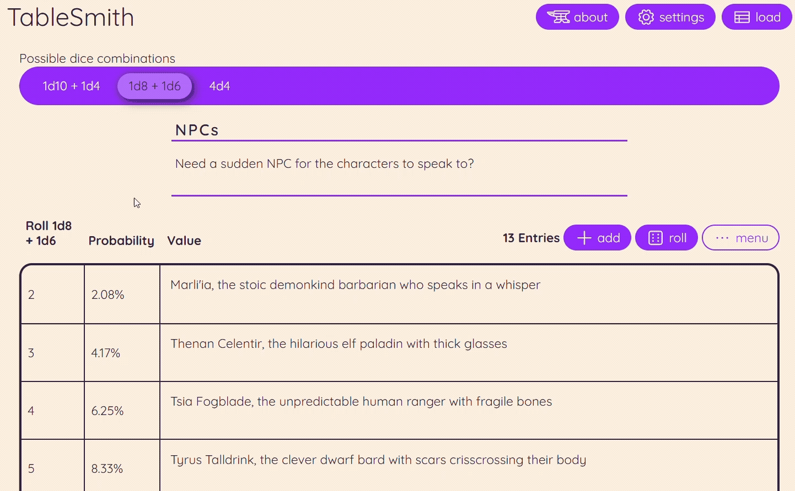

#  TableSmith

## Description / Overview
TableSmith started from a question:

> "Is there a way I can roll dice for any random number of items?"

Turns out, the answer is yes! (especially if you include a coin)

TableSmith does the math for you to find which combinations cover exactly the number of options you provide and provides insight into the tradeoffs of different combinations. This way, all you have to do is make the table and then roll the dice!



## Installation
**Node version**: v24.11.1  
To install the project, follow these steps:

1. **Clone the Repository**:
   ```bash
   git clone https://github.com/rachelschnaubelt/tablesmith.git
   ```

2. **Navigate to the Directory**:
   ```bash
   cd tablesmith
   ```

3. **Install Dependencies**:
   ```bash
   npm install
   ```

## Usage
### Development Mode

To start the development server, run:

```bash
npm run dev
```

This will open your project in the default web browser at `http://localhost:5173`.

### Build for Production

To build the project for production, use:

```bash
npm run build
```

The built files will be located in the `dist` directory.

### Preview Mode

To preview the build locally before deploying, use:

```bash
npm run preview
```

The server will start on `http://localhost:3000`.

### Testing

For running tests and viewing coverage reports, execute:

```bash
npm run test
```
or for full coverage:
```bash
npm run coverage
```

This command uses Vitest to run your tests.

## Features
- Add, remove, and reorganize rows
- Relevant probability statistics and distribution visualizations
- Save and load tables with localStorage
- Digital roller (if you don't want to use physical dice)
- Clean copy and print capabilities
- Settings for which dice to use
- A range of quickstart and example tables
- Light and dark theming

## Roadmap (in no particular order, and with no guarantees)
- Create table from a list (comma separated)
- Download as CSV
- Upload from CSV
- Add custom dice
- Update copy functionality for spreadsheet software formatting
- Drag and drop reordering
- Modifiers (static e.g. +3, random e.g. +1d4)
- Card tables (separate mode)
- Ranged/PbtA style tables (separate mode)
- Multi-column tables
- Column-based tables
- Roll history
- PWA support
- 3D animated dice models on hover and for digital rolls (Three.js / react-three-fiber)
- Shuffle entries button
- Cumulative probability range slider
- Comparison mode
- Rich text textarea inputs
- Input sanitization
- Server-side PDF generation via Puppeteer (requires backend)
- Fantasy theme
- Sci-fi theme
- API for the math

### Less likely roadmap items
- Plinko distribution/tool
- Spin a wheel distribution/tool
- Roulette or other random selection methods
- Reachability grid

## The Math
In order to figure out what dice you can roll to get a certain range of numbers, it's actually a bit simpler than it might seem.

First, you have to realize that each die contributes a certain portion to a given range: however many faces the die has minus one.

Then, you have to understand that the actual target is really n - 1.

Once you have those facts, you can recursively iterate through the dice, subtracting their contribution from the target. Once the value is zero, you've got a combination that will cover the range of options.

(During the recursion, I added a few gates to prevent too many options or ridiculous combinations with a bunch of coin flips. I also made sure to prevent duplicates by sorting each combination and using a Set to capture all possible combinations without repetition.)

From there, you can run statistical analyses on the combinations to get the probability any number will come up or how many different ways you can get a given number. To do this, just iterate through the dice in a combination, expanding each existing sum by each face on the die. Then divide each number's possible ways to be rolled by the total number of rolls that can happen to get the probability it will come up. You can then get all kinds of other statistical info from there, such as variance and standard deviation.

An example:

Let's say we want to get all the ways we could roll four-sided dice (1d4) and six sided dice (1d6) to cover a list of 19 options.

- Our actual target is 18.
- A d4 can contribute 3 toward a target.
- A d6 can contribute 5 toward a target.

18 - 3 - 3 - 3 - 3 - 3 - 3 = 0 (this gives us 6d4)  
18 - 3 - 5 - 5 - 5 = 0 (this gives us 1d4 + 3d6)

6d4 will have a range between 6 (the total number of dice) and 24 (the total number of dice * the largest face on the dice)  
1d4 + 3d6 will have a range between 4 (4 dice) and 22 (1 * 4 + 3 * 6)

The probability distribution for each of these combinations is different as well. A few examples:

| combination | value | probability |
| ----------- | ----- | ----------- |
| 6d4         | 22    | 0.51%       |
| 1d4 + 3d6   | 22    | 0.12%       |
| 6d4         | 13    | 11.13%      |
| 1d4 + 3d6   | 13    | 12.04%      |
| 6d4         | 5     | 0.02%       |
| 1d4 + 3d6   | 5     | 1.16%       |

## Built With

**Frontend:**
- **React**: component-based UI
- **Vite**: native TypeScript support, good SVG handling via vite-plugin-svgr
- **Zustand**: idiomatic state management for frequent state updates, allowing for precise rerender control
- **SCSS**: two-layer theming system: primitive tokens (raw values) and semantic tokens (meaningful SASS values referencing primitives). Theme switching via class on html tag.

**Libraries & Packages:**
- **Recharts**: React-native charting, minimal boilerplate, data already in the right shape. Considered Chart.js and native Canvas as alternatives

**Development Tools:**
- **Vitest**: chosen over Jest for lighter weight and native Vite integration

**Utilities & Plugins:**
- **Phosphor Icons React**: chosen over FontAwesome for multiple weight variants
- **SVG Import Plugin (vite-plugin-svgr)**: used to support custom SVG icons used for dice and site icon

## Key Design Decisions & Tradeoffs
### Algorithm constraints:
- Max combo depth capped to prevent combinatorial explosion
- d2 repetitions limited (too many d2s = silly and computationally expensive)
- Results capped at ~10 combos per n to keep search tractable
- Options object ordered largest-to-smallest so greedy/efficient combos are found first

### State management:
- Zustand chosen over Context API for precise rerender control, as Zustand includes selectors to prevent large amounts of rerenders due to minor state changes

### Performance:
- Performance initially suffered due to the large number of state-managed inputs causing rerender cascades.
- Resolution:
  - Created isolated input components that subscribe only to their own specific index
  - Memoized Recharts and calculations to manage rerenders and recalculation

### Architecture:
- Pure calculation functions kept outside React components entirely
- Store actions handle complex multi-state updates atomically
- JavaScript used for initial momentum, migrated to TypeScript for stability

### Things that were explored, but not built (and why)
- **Share feature**: requires backend, scope too large
- **Client-side PDF**: html2pdf quality unacceptable, Puppeteer requires backend
- **Median/mean**: not actionable for DMs, standard deviation covers the need better
- **Math.random → crypto.getRandomValues**: overkill, threat model is essentially zero for dice rolls
- **Plinko/wheel/roulette**: interesting but undermine the physical dice philosophy

## Contributing
Not currently accepting contributions

## License
[](https://creativecommons.org/licenses/by-nc-sa/4.0/)  
[CC BY-NC-SA 4.0](https://creativecommons.org/licenses/by-nc-sa/4.0/)

